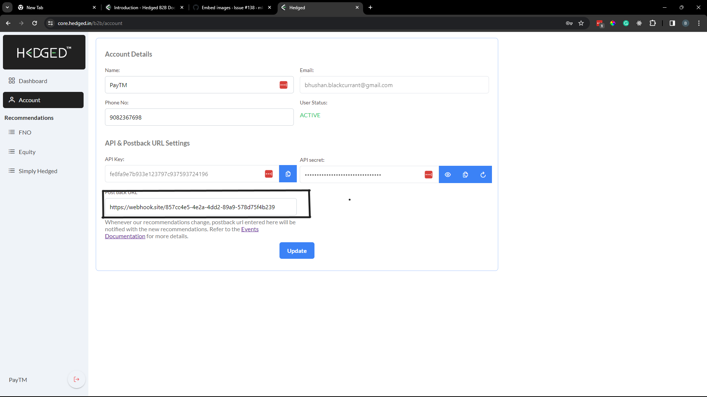

# Post Back

A postback URL would allow you to receive updates on recommendations that you have subscribed to.

To use Postback, please add your postback URL through the [console](https://core.hedged.online/b2b/account). After this, have a server at this postback url to receive events on the recommendations.



## Events

There are 3 types of events:

1. Published Event (PUBLISHED):
   When the recommendation actually gets published.
2. Update Event (MODIFIED):
   Whenever there are updates to one of the published recommendation.
3. Closed Event (CLOSED):
   When the recommendation finally gets closed.
4. GreeIn Suggestions:
   When GreeIn sends us an update, we forward those updates to you based on your preferences.

## Expected body according to event

1.  PUBLISHED:

        When a recommendation is published, expect the following response:

    | Object Property   |                      Value                      |                                                                                                   Remarks |
    | ----------------- | :---------------------------------------------: | --------------------------------------------------------------------------------------------------------: |
    | eventType         |                   "PUBLISHED"                   |                                                        This tells you the type of event among the 3 types |
    | b2BRecommendation | [Recommendation Object](#recommendation-object) | This will give you the full details of the corresponding recommendation object, with its legs and history |

    Response:

    ```jsonc
    {
      "b2BRecommendation": {
        "uuid": "33ba04b5-9fd2-46cb-8897-a4b529317dd4",
        "name": "IRFC",
        "tradeLogic": "<p>test</p>",
        "status": "PUBLISHED",
        "canEnter": true,
        "bookedPnL": 0,
        "mtm": 0,
        "finalPnL": 0,
        "bias": "NEUTRAL",
        "author": "Bhushan",
        "equityCaptitalRequired": 0,
        "hedgeCapitalRequired": 0,
        "capitalRequired": 10000,
        "capitalDeployed": 10000,
        "maxProfit": 5000,
        "expectedProfit": 2500,
        "maxLoss": 2000,
        "fundType": "EQUITY",
        "expectedDurationInDays": 30,
        "publishedAt": "2023-12-19T06:25:16.000Z",
        "closedAt": null,
        "version": 1,
        "payoffChartImg": null,
        "tradeLogicImg": null,
        "createdAt": "2023-12-19T06:23:55.825Z",
        "updatedAt": "2023-12-19T06:25:19.000Z",
        "id": 8,
        "generatedBy": "MANUAL",
        "target": "GROUP",
        "Instrument": {
          "id": "NSE:IRFC",
          "instrument_token": 519425,
          "exchange_token": 2029,
          "tradingsymbol": "IRFC",
          "name": "INDIAN RAILWAY FIN CORP L",
          "last_price": 94.7,
          "expiry": "1899-11-30",
          "strike": 0,
          "tick_size": 0,
          "lot_size": 1,
          "instrument_type": "EQ",
          "segment": "NSE",
          "exchange": "NSE",
          "createdAt": "2023-12-14T06:34:56.027Z",
          "updatedAt": "2023-12-15T13:17:11.000Z"
        },
        "B2BRecommendationHistories": [
          {
            "id": 26,
            "oldStatus": "DRAFT",
            "newStatus": "PUBLISHED",
            "comment": "Initial publish",
            "showData": true,
            "createdAt": "2023-12-19T06:25:19.977Z",
            "B2BRecommendationLegHistories": [
              {
                "id": 29,
                "oldStatus": "DRAFT",
                "newStatus": "ENTER",
                "comment": "Recommendation published",
                "showData": true,
                "action": "BUY",
                "isExit": false,
                "quantity": 100,
                "instrumentName": "INDIAN RAILWAY FIN CORP L",
                "entryPrice": 95,
                "exitPrice": null,
                "createdAt": "2023-12-19T06:25:20.191Z",
                "b2BRecommendationLegId": 10,
                "b2BRecommendationHistoryId": 26
              }
            ],
            "b2BRecommendationId": 8
          }
        ],
        "B2BRecommendationLegs": [
          {
            "id": 10,
            "uuid": "061f7d8d-28b9-4ee1-baaa-ea16484c8af8",
            "status": "ENTER",
            "action": "BUY",
            "quantity": 100,
            "canEnter": true,
            "entryThreshold": 5,
            "entryPrice": 94.7,
            "exitPrice": null,
            "entryAt": null,
            "exitAt": null,
            "mtm": 0,
            "finalPnL": 0,
            "sequenceInParent": 1,
            "entryParentVersion": 1,
            "exitParentVersion": 0,
            "createdAt": "2023-12-19T06:23:55.975Z",
            "updatedAt": "2023-12-19T06:25:20.000Z",
            "B2BRecommendationLegHistories": [
              {
                "id": 29,
                "oldStatus": "DRAFT",
                "newStatus": "ENTER",
                "comment": "Recommendation published",
                "showData": true,
                "action": "BUY",
                "isExit": false,
                "quantity": 100,
                "instrumentName": "INDIAN RAILWAY FIN CORP L",
                "entryPrice": 95,
                "exitPrice": null,
                "createdAt": "2023-12-19T06:25:20.191Z",
                "b2BRecommendationLegId": 10,
                "b2BRecommendationHistoryId": 26
              }
            ],
            "Instrument": {
              "id": "NSE:IRFC",
              "instrument_token": 519425,
              "exchange_token": 2029,
              "tradingsymbol": "IRFC",
              "name": "INDIAN RAILWAY FIN CORP L",
              "last_price": 94.7,
              "expiry": "1899-11-30",
              "strike": 0,
              "tick_size": 0,
              "lot_size": 1,
              "instrument_type": "EQ",
              "segment": "NSE",
              "exchange": "NSE",
              "createdAt": "2023-12-14T06:34:56.027Z",
              "updatedAt": "2023-12-15T13:17:11.000Z"
            },
            "b2BRecommendationId": 8,
            "instrumentId": "NSE:IRFC"
          }
        ],
        "B2BRecommendationTargets": [],
        "TargetClasses": [
          {
            "id": 22,
            "code": "$2b$08$YehP92gsOJqAbNUi/6/xL.w2dXNwV6CLMWNaJsmPk0bDDMXN7d2tG",
            "name": "Simply Hedged",
            "isDisabled": false
          }
        ],
        "instrumentId": "NSE:IRFC"
      },
      "eventType": "PUBLISHED"
    }
    ```

2.  MODIFIED:

        When a recommendation is updated after being published, expect the following response:

    | Object Property   |                          Value                          |                                                                                                   Remarks |
    | ----------------- | :-----------------------------------------------------: | --------------------------------------------------------------------------------------------------------: |
    | eventType         |                       "PUBLISHED"                       |                                                        This tells you the type of event among the 3 types |
    | b2BRecommendation |     [Recommendation Object](#recommendation-object)     | This will give you the full details of the corresponding recommendation object, with its legs and history |
    | legsAdded         | [Recommendation Leg Object](#recommendation-leg-object) |                                                          The legs that were added as part of this update. |
    | legsModified      | [Recommendation Leg Object](#recommendation-leg-object) |                                               The legs that were updated/modified as part of this update. |
    | legsExited        | [Recommendation Leg Object](#recommendation-leg-object) |                                                         The legs that were exited as part of this update. |

    Please refer to the Recommendation object's `B2BRecommendationLegs` property for further details of the BB Recommendation Leg object

    Response:

    ```jsonc
    {
      "b2BRecommendation": {
        "uuid": "33ba04b5-9fd2-46cb-8897-a4b529317dd4",
        "name": "IRFC",
        "tradeLogic": "<p>test</p>",
        "status": "PUBLISHED",
        "canEnter": true,
        "bookedPnL": 30,
        "mtm": 0,
        "finalPnL": 0,
        "bias": "NEUTRAL",
        "author": "Bhushan",
        "equityCaptitalRequired": 0,
        "hedgeCapitalRequired": 0,
        "capitalRequired": 10000,
        "capitalDeployed": 10000,
        "maxProfit": 5000,
        "expectedProfit": 2500,
        "maxLoss": 2000,
        "fundType": "EQUITY",
        "expectedDurationInDays": 30,
        "publishedAt": "2023-12-19T06:25:16.000Z",
        "closedAt": null,
        "version": 2,
        "payoffChartImg": null,
        "tradeLogicImg": null,
        "createdAt": "2023-12-19T06:23:55.825Z",
        "updatedAt": "2023-12-19T06:33:02.000Z",
        "id": 8,
        "generatedBy": "MANUAL",
        "target": "GROUP",
        "Instrument": {
          "id": "NSE:IRFC",
          "instrument_token": 519425,
          "exchange_token": 2029,
          "tradingsymbol": "IRFC",
          "name": "INDIAN RAILWAY FIN CORP L",
          "last_price": 94.7,
          "expiry": "1899-11-30",
          "strike": 0,
          "tick_size": 0,
          "lot_size": 1,
          "instrument_type": "EQ",
          "segment": "NSE",
          "exchange": "NSE",
          "createdAt": "2023-12-14T06:34:56.027Z",
          "updatedAt": "2023-12-15T13:17:11.000Z"
        },
        "B2BRecommendationHistories": [
          {
            "id": 27,
            "oldStatus": "PUBLISHED",
            "newStatus": "PUBLISHED",
            "comment": "close and add buy\n",
            "showData": true,
            "createdAt": "2023-12-19T06:33:01.791Z",
            "B2BRecommendationLegHistories": [
              {
                "id": 30,
                "oldStatus": null,
                "newStatus": "ENTER",
                "comment": "Leg Added in modification",
                "showData": true,
                "action": "BUY",
                "isExit": false,
                "quantity": 50,
                "instrumentName": "INDIAN RAILWAY FIN CORP L",
                "entryPrice": 95,
                "exitPrice": null,
                "createdAt": "2023-12-19T06:33:02.012Z",
                "b2BRecommendationLegId": 11,
                "b2BRecommendationHistoryId": 27
              },
              {
                "id": 31,
                "oldStatus": "ENTER",
                "newStatus": "EXIT",
                "comment": "Leg Closed in Modification",
                "showData": true,
                "action": "BUY",
                "isExit": true,
                "quantity": 100,
                "instrumentName": "INDIAN RAILWAY FIN CORP L",
                "entryPrice": 95,
                "exitPrice": 95,
                "createdAt": "2023-12-19T06:33:02.280Z",
                "b2BRecommendationLegId": 10,
                "b2BRecommendationHistoryId": 27
              }
            ],
            "b2BRecommendationId": 8
          },
          {
            "id": 26,
            "oldStatus": "DRAFT",
            "newStatus": "PUBLISHED",
            "comment": "Initial publish",
            "showData": true,
            "createdAt": "2023-12-19T06:25:19.977Z",
            "B2BRecommendationLegHistories": [
              {
                "id": 29,
                "oldStatus": "DRAFT",
                "newStatus": "ENTER",
                "comment": "Recommendation published",
                "showData": true,
                "action": "BUY",
                "isExit": false,
                "quantity": 100,
                "instrumentName": "INDIAN RAILWAY FIN CORP L",
                "entryPrice": 95,
                "exitPrice": null,
                "createdAt": "2023-12-19T06:25:20.191Z",
                "b2BRecommendationLegId": 10,
                "b2BRecommendationHistoryId": 26
              }
            ],
            "b2BRecommendationId": 8
          }
        ],
        "B2BRecommendationLegs": [
          {
            "id": 10,
            "uuid": "061f7d8d-28b9-4ee1-baaa-ea16484c8af8",
            "status": "EXIT",
            "action": "BUY",
            "quantity": 100,
            "canEnter": true,
            "entryThreshold": 5,
            "entryPrice": 94.7,
            "exitPrice": 95,
            "entryAt": null,
            "exitAt": "2023-12-19T06:32:58.000Z",
            "mtm": 30,
            "finalPnL": 30,
            "sequenceInParent": 1,
            "entryParentVersion": 1,
            "exitParentVersion": 2,
            "createdAt": "2023-12-19T06:23:55.975Z",
            "updatedAt": "2023-12-19T06:33:02.000Z",
            "B2BRecommendationLegHistories": [
              {
                "id": 31,
                "oldStatus": "ENTER",
                "newStatus": "EXIT",
                "comment": "Leg Closed in Modification",
                "showData": true,
                "action": "BUY",
                "isExit": true,
                "quantity": 100,
                "instrumentName": "INDIAN RAILWAY FIN CORP L",
                "entryPrice": 95,
                "exitPrice": 95,
                "createdAt": "2023-12-19T06:33:02.280Z",
                "b2BRecommendationLegId": 10,
                "b2BRecommendationHistoryId": 27
              },
              {
                "id": 29,
                "oldStatus": "DRAFT",
                "newStatus": "ENTER",
                "comment": "Recommendation published",
                "showData": true,
                "action": "BUY",
                "isExit": false,
                "quantity": 100,
                "instrumentName": "INDIAN RAILWAY FIN CORP L",
                "entryPrice": 95,
                "exitPrice": null,
                "createdAt": "2023-12-19T06:25:20.191Z",
                "b2BRecommendationLegId": 10,
                "b2BRecommendationHistoryId": 26
              }
            ],
            "Instrument": {
              "id": "NSE:IRFC",
              "instrument_token": 519425,
              "exchange_token": 2029,
              "tradingsymbol": "IRFC",
              "name": "INDIAN RAILWAY FIN CORP L",
              "last_price": 94.7,
              "expiry": "1899-11-30",
              "strike": 0,
              "tick_size": 0,
              "lot_size": 1,
              "instrument_type": "EQ",
              "segment": "NSE",
              "exchange": "NSE",
              "createdAt": "2023-12-14T06:34:56.027Z",
              "updatedAt": "2023-12-15T13:17:11.000Z"
            },
            "b2BRecommendationId": 8,
            "instrumentId": "NSE:IRFC"
          },
          {
            "id": 11,
            "uuid": "bebdfb84-7fb3-4122-a637-193a7ff00eb3",
            "status": "ENTER",
            "action": "BUY",
            "quantity": 50,
            "canEnter": true,
            "entryThreshold": 5,
            "entryPrice": 94.7,
            "exitPrice": null,
            "entryAt": "2023-12-19T06:32:58.000Z",
            "exitAt": null,
            "mtm": 0,
            "finalPnL": null,
            "sequenceInParent": 2,
            "entryParentVersion": 2,
            "exitParentVersion": 0,
            "createdAt": "2023-12-19T06:33:01.926Z",
            "updatedAt": "2023-12-19T06:33:01.926Z",
            "B2BRecommendationLegHistories": [
              {
                "id": 30,
                "oldStatus": null,
                "newStatus": "ENTER",
                "comment": "Leg Added in modification",
                "showData": true,
                "action": "BUY",
                "isExit": false,
                "quantity": 50,
                "instrumentName": "INDIAN RAILWAY FIN CORP L",
                "entryPrice": 95,
                "exitPrice": null,
                "createdAt": "2023-12-19T06:33:02.012Z",
                "b2BRecommendationLegId": 11,
                "b2BRecommendationHistoryId": 27
              }
            ],
            "Instrument": {
              "id": "NSE:IRFC",
              "instrument_token": 519425,
              "exchange_token": 2029,
              "tradingsymbol": "IRFC",
              "name": "INDIAN RAILWAY FIN CORP L",
              "last_price": 94.7,
              "expiry": "1899-11-30",
              "strike": 0,
              "tick_size": 0,
              "lot_size": 1,
              "instrument_type": "EQ",
              "segment": "NSE",
              "exchange": "NSE",
              "createdAt": "2023-12-14T06:34:56.027Z",
              "updatedAt": "2023-12-15T13:17:11.000Z"
            },
            "b2BRecommendationId": 8,
            "instrumentId": "NSE:IRFC"
          }
        ],
        "B2BRecommendationTargets": [],
        "TargetClasses": [
          {
            "id": 22,
            "code": "$2b$08$YehP92gsOJqAbNUi/6/xL.w2dXNwV6CLMWNaJsmPk0bDDMXN7d2tG",
            "name": "Simply Hedged",
            "isDisabled": false
          }
        ],
        "instrumentId": "NSE:IRFC"
      },
      "eventType": "MODIFIED",
      "legsAdded": [
        {
          "status": "ENTER",
          "action": "BUY",
          "entryPrice": 94.7,
          "entryAt": "2023-12-19T06:32:57.968Z",
          "exitAt": null,
          "finalPnL": null,
          "mtm": 0,
          "b2BRecommendationId": 8,
          "quantity": 50,
          "sequenceInParent": 2,
          "entryParentVersion": 2,
          "exitParentVersion": 0,
          "id": 11,
          "Instrument": {
            "id": "NSE:IRFC",
            "instrument_token": 519425,
            "exchange_token": 2029,
            "tradingsymbol": "IRFC",
            "name": "INDIAN RAILWAY FIN CORP L",
            "last_price": 94.7,
            "expiry": "1899-11-30",
            "strike": 0,
            "tick_size": 0,
            "lot_size": 1,
            "instrument_type": "EQ",
            "segment": "NSE",
            "exchange": "NSE",
            "createdAt": "2023-12-14T06:34:56.027Z",
            "updatedAt": "2023-12-15T13:17:11.000Z"
          },
          "entryThreshold": 5,
          "B2BRecommendation": {
            "uuid": "33ba04b5-9fd2-46cb-8897-a4b529317dd4",
            "name": "IRFC",
            "tradeLogic": "<p>test</p>",
            "status": "PUBLISHED",
            "canEnter": true,
            "bookedPnL": 0,
            "mtm": 0,
            "finalPnL": 0,
            "bias": "NEUTRAL",
            "author": "Bhushan",
            "equityCaptitalRequired": 0,
            "hedgeCapitalRequired": 0,
            "capitalRequired": 10000,
            "capitalDeployed": 10000,
            "maxProfit": 5000,
            "expectedProfit": 2500,
            "maxLoss": 2000,
            "fundType": "EQUITY",
            "expectedDurationInDays": 30,
            "publishedAt": "2023-12-19T06:25:16.000Z",
            "closedAt": null,
            "version": 2,
            "payoffChartImg": null,
            "tradeLogicImg": null,
            "createdAt": "2023-12-19T06:23:55.825Z",
            "updatedAt": "2023-12-19T06:33:01.000Z",
            "id": 8,
            "generatedBy": "MANUAL",
            "target": "GROUP",
            "Instrument": {
              "id": "NSE:IRFC",
              "instrument_token": 519425,
              "exchange_token": 2029,
              "tradingsymbol": "IRFC",
              "name": "INDIAN RAILWAY FIN CORP L",
              "last_price": 94.7,
              "expiry": "1899-11-30",
              "strike": 0,
              "tick_size": 0,
              "lot_size": 1,
              "instrument_type": "EQ",
              "segment": "NSE",
              "exchange": "NSE",
              "createdAt": "2023-12-14T06:34:56.027Z",
              "updatedAt": "2023-12-15T13:17:11.000Z"
            },
            "B2BRecommendationHistories": [
              {
                "id": 25,
                "oldStatus": null,
                "newStatus": "DRAFT",
                "comment": "Initial creation",
                "showData": false,
                "createdAt": "2023-12-19T06:23:56.166Z",
                "B2BRecommendationLegHistories": [],
                "b2BRecommendationId": 8
              },
              {
                "id": 26,
                "oldStatus": "DRAFT",
                "newStatus": "PUBLISHED",
                "comment": "Initial publish",
                "showData": true,
                "createdAt": "2023-12-19T06:25:19.977Z",
                "B2BRecommendationLegHistories": [
                  {
                    "id": 29,
                    "oldStatus": "DRAFT",
                    "newStatus": "ENTER",
                    "comment": "Recommendation published",
                    "showData": true,
                    "action": "BUY",
                    "isExit": false,
                    "quantity": 100,
                    "instrumentName": "INDIAN RAILWAY FIN CORP L",
                    "entryPrice": 95,
                    "exitPrice": null,
                    "createdAt": "2023-12-19T06:25:20.191Z",
                    "b2BRecommendationLegId": 10,
                    "b2BRecommendationHistoryId": 26
                  }
                ],
                "b2BRecommendationId": 8
              }
            ],
            "B2BRecommendationLegs": [
              {
                "id": 10,
                "uuid": "061f7d8d-28b9-4ee1-baaa-ea16484c8af8",
                "status": "EXIT",
                "action": "BUY",
                "quantity": 100,
                "canEnter": true,
                "entryThreshold": 5,
                "entryPrice": 94.7,
                "exitPrice": 95,
                "entryAt": null,
                "exitAt": "2023-12-19T06:32:58.192Z",
                "mtm": 29.999999999999716,
                "finalPnL": 29.999999999999716,
                "sequenceInParent": 1,
                "entryParentVersion": 1,
                "exitParentVersion": 2,
                "createdAt": "2023-12-19T06:23:55.975Z",
                "updatedAt": "2023-12-19T06:33:02.000Z",
                "B2BRecommendationLegHistories": [
                  {
                    "id": 28,
                    "oldStatus": null,
                    "newStatus": "DRAFT",
                    "comment": "Initial leg creation",
                    "showData": false,
                    "action": null,
                    "isExit": false,
                    "quantity": null,
                    "instrumentName": null,
                    "entryPrice": null,
                    "exitPrice": null,
                    "createdAt": "2023-12-19T06:23:56.070Z",
                    "b2BRecommendationLegId": 10,
                    "b2BRecommendationHistoryId": null
                  },
                  {
                    "id": 29,
                    "oldStatus": "DRAFT",
                    "newStatus": "ENTER",
                    "comment": "Recommendation published",
                    "showData": true,
                    "action": "BUY",
                    "isExit": false,
                    "quantity": 100,
                    "instrumentName": "INDIAN RAILWAY FIN CORP L",
                    "entryPrice": 95,
                    "exitPrice": null,
                    "createdAt": "2023-12-19T06:25:20.191Z",
                    "b2BRecommendationLegId": 10,
                    "b2BRecommendationHistoryId": 26
                  }
                ],
                "Instrument": {
                  "id": "NSE:IRFC",
                  "instrument_token": 519425,
                  "exchange_token": 2029,
                  "tradingsymbol": "IRFC",
                  "name": "INDIAN RAILWAY FIN CORP L",
                  "last_price": 94.7,
                  "expiry": "1899-11-30",
                  "strike": 0,
                  "tick_size": 0,
                  "lot_size": 1,
                  "instrument_type": "EQ",
                  "segment": "NSE",
                  "exchange": "NSE",
                  "createdAt": "2023-12-14T06:34:56.027Z",
                  "updatedAt": "2023-12-15T13:17:11.000Z"
                },
                "b2BRecommendationId": 8,
                "instrumentId": "NSE:IRFC"
              }
            ],
            "B2BRecommendationTargets": [],
            "TargetClasses": [
              {
                "id": 22,
                "code": "$2b$08$YehP92gsOJqAbNUi/6/xL.w2dXNwV6CLMWNaJsmPk0bDDMXN7d2tG",
                "name": "Simply Hedged",
                "isDisabled": false
              }
            ],
            "instrumentId": "NSE:IRFC"
          },
          "exitPrice": null,
          "uuid": "bebdfb84-7fb3-4122-a637-193a7ff00eb3",
          "canEnter": true,
          "createdAt": "2023-12-19T06:33:01.926Z",
          "updatedAt": "2023-12-19T06:33:01.926Z",
          "instrumentId": "NSE:IRFC"
        }
      ],
      "legsModified": [],
      "legsExited": [
        {
          "id": 10,
          "uuid": "061f7d8d-28b9-4ee1-baaa-ea16484c8af8",
          "status": "EXIT",
          "action": "BUY",
          "quantity": 100,
          "canEnter": true,
          "entryThreshold": 5,
          "entryPrice": 94.7,
          "exitPrice": 95,
          "entryAt": null,
          "exitAt": "2023-12-19T06:32:58.192Z",
          "mtm": 29.999999999999716,
          "finalPnL": 29.999999999999716,
          "sequenceInParent": 1,
          "entryParentVersion": 1,
          "exitParentVersion": 2,
          "createdAt": "2023-12-19T06:23:55.975Z",
          "updatedAt": "2023-12-19T06:33:02.000Z",
          "B2BRecommendationLegHistories": [
            {
              "id": 28,
              "oldStatus": null,
              "newStatus": "DRAFT",
              "comment": "Initial leg creation",
              "showData": false,
              "action": null,
              "isExit": false,
              "quantity": null,
              "instrumentName": null,
              "entryPrice": null,
              "exitPrice": null,
              "createdAt": "2023-12-19T06:23:56.070Z",
              "b2BRecommendationLegId": 10,
              "b2BRecommendationHistoryId": null
            },
            {
              "id": 29,
              "oldStatus": "DRAFT",
              "newStatus": "ENTER",
              "comment": "Recommendation published",
              "showData": true,
              "action": "BUY",
              "isExit": false,
              "quantity": 100,
              "instrumentName": "INDIAN RAILWAY FIN CORP L",
              "entryPrice": 95,
              "exitPrice": null,
              "createdAt": "2023-12-19T06:25:20.191Z",
              "b2BRecommendationLegId": 10,
              "b2BRecommendationHistoryId": 26
            }
          ],
          "Instrument": {
            "id": "NSE:IRFC",
            "instrument_token": 519425,
            "exchange_token": 2029,
            "tradingsymbol": "IRFC",
            "name": "INDIAN RAILWAY FIN CORP L",
            "last_price": 94.7,
            "expiry": "1899-11-30",
            "strike": 0,
            "tick_size": 0,
            "lot_size": 1,
            "instrument_type": "EQ",
            "segment": "NSE",
            "exchange": "NSE",
            "createdAt": "2023-12-14T06:34:56.027Z",
            "updatedAt": "2023-12-15T13:17:11.000Z"
          },
          "b2BRecommendationId": 8,
          "instrumentId": "NSE:IRFC"
        }
      ]
    }
    ```

3.  CLOSED:

        When a recommendation is closed, expect the following response:

    | Object Property   |                      Value                      |                                                                                                   Remarks |
    | ----------------- | :---------------------------------------------: | --------------------------------------------------------------------------------------------------------: |
    | eventType         |                    "CLOSED"                     |                                                        This tells you the type of event among the 3 types |
    | b2BRecommendation | [Recommendation Object](#recommendation-object) | This will give you the full details of the corresponding recommendation object, with its legs and history |

    Response:

    ```jsonc
    {
      "b2BRecommendation": {
        "uuid": "e57fc12f-8b75-41e3-a44d-4a261910b5d0",
        "name": "Upper circuit",
        "tradeLogic": "<p>upper circuit</p>",
        "status": "CLOSED",
        "canEnter": false,
        "bookedPnL": -10200,
        "mtm": 0,
        "finalPnL": -10200,
        "bias": "NEUTRAL",
        "author": "vikas`",
        "equityCaptitalRequired": 44,
        "hedgeCapitalRequired": 55,
        "capitalRequired": 99,
        "capitalDeployed": 44,
        "maxProfit": 5000,
        "expectedProfit": 14004000,
        "maxLoss": 2000,
        "fundType": "SIMPLY_HEDGED",
        "expectedDurationInDays": 845,
        "publishedAt": "2023-12-19T07:35:35.000Z",
        "closedAt": "2023-12-19T08:05:19.000Z",
        "version": 2,
        "payoffChartImg": null,
        "tradeLogicImg": null,
        "createdAt": "2023-12-19T07:32:07.851Z",
        "updatedAt": "2023-12-19T08:05:23.000Z",
        "id": 11,
        "generatedBy": "MANUAL",
        "target": "GROUP",
        "Instrument": null,
        "B2BRecommendationHistories": [
          {
            "id": 34,
            "oldStatus": "PUBLISHED",
            "newStatus": "CLOSED",
            "comment": "closing",
            "showData": true,
            "createdAt": "2023-12-19T08:05:22.680Z",
            "B2BRecommendationLegHistories": [
              {
                "id": 38,
                "oldStatus": "ENTER",
                "newStatus": "EXIT",
                "comment": "Leg was exited as recommendation was closed",
                "showData": true,
                "action": "BUY",
                "isExit": false,
                "quantity": 1,
                "instrumentName": "ADANIENT",
                "entryPrice": 44,
                "exitPrice": 10,
                "createdAt": "2023-12-19T08:05:22.917Z",
                "b2BRecommendationLegId": 14,
                "b2BRecommendationHistoryId": 34
              }
            ],
            "b2BRecommendationId": 11
          },
          {
            "id": 31,
            "oldStatus": "DRAFT",
            "newStatus": "PUBLISHED",
            "comment": "Initial publish",
            "showData": true,
            "createdAt": "2023-12-19T07:35:34.527Z",
            "B2BRecommendationLegHistories": [
              {
                "id": 35,
                "oldStatus": "DRAFT",
                "newStatus": "ENTER",
                "comment": "Recommendation published",
                "showData": true,
                "action": "BUY",
                "isExit": false,
                "quantity": 1,
                "instrumentName": "ADANIENT",
                "entryPrice": 44,
                "exitPrice": null,
                "createdAt": "2023-12-19T07:35:34.737Z",
                "b2BRecommendationLegId": 14,
                "b2BRecommendationHistoryId": 31
              }
            ],
            "b2BRecommendationId": 11
          }
        ],
        "B2BRecommendationLegs": [
          {
            "id": 14,
            "uuid": "edab8afd-39d7-48be-b455-8fa90d1776e1",
            "status": "EXIT",
            "action": "BUY",
            "quantity": 1,
            "canEnter": false,
            "entryThreshold": 30,
            "entryPrice": 44,
            "exitPrice": 10,
            "entryAt": null,
            "exitAt": "2023-12-19T08:05:19.000Z",
            "mtm": -10200,
            "finalPnL": -10200,
            "sequenceInParent": 1,
            "entryParentVersion": 1,
            "exitParentVersion": 2,
            "createdAt": "2023-12-19T07:32:07.952Z",
            "updatedAt": "2023-12-19T08:05:22.000Z",
            "B2BRecommendationLegHistories": [
              {
                "id": 38,
                "oldStatus": "ENTER",
                "newStatus": "EXIT",
                "comment": "Leg was exited as recommendation was closed",
                "showData": true,
                "action": "BUY",
                "isExit": false,
                "quantity": 1,
                "instrumentName": "ADANIENT",
                "entryPrice": 44,
                "exitPrice": 10,
                "createdAt": "2023-12-19T08:05:22.917Z",
                "b2BRecommendationLegId": 14,
                "b2BRecommendationHistoryId": 34
              },
              {
                "id": 35,
                "oldStatus": "DRAFT",
                "newStatus": "ENTER",
                "comment": "Recommendation published",
                "showData": true,
                "action": "BUY",
                "isExit": false,
                "quantity": 1,
                "instrumentName": "ADANIENT",
                "entryPrice": 44,
                "exitPrice": null,
                "createdAt": "2023-12-19T07:35:34.737Z",
                "b2BRecommendationLegId": 14,
                "b2BRecommendationHistoryId": 31
              }
            ],
            "Instrument": {
              "id": "NFO:ADANIENT23DEC1850CE",
              "instrument_token": 18270466,
              "exchange_token": 71369,
              "tradingsymbol": "ADANIENT23DEC1850CE",
              "name": "ADANIENT",
              "last_price": 0,
              "expiry": "2023-12-28",
              "strike": 1850,
              "tick_size": 0,
              "lot_size": 300,
              "instrument_type": "CE",
              "segment": "NFO-OPT",
              "exchange": "NFO",
              "createdAt": "2023-12-14T06:34:33.129Z",
              "updatedAt": "2023-12-14T06:34:33.129Z"
            },
            "b2BRecommendationId": 11,
            "instrumentId": "NFO:ADANIENT23DEC1850CE"
          }
        ],
        "B2BRecommendationTargets": [],
        "TargetClasses": [
          {
            "id": 22,
            "code": "$2b$08$YehP92gsOJqAbNUi/6/xL.w2dXNwV6CLMWNaJsmPk0bDDMXN7d2tG",
            "name": "Simply Hedged",
            "isDisabled": false
          }
        ],
        "instrumentId": null
      },
      "eventType": "CLOSED"
    }
    ```

4.  GreeIn:

        Please expect a hit to your postBack URL whenever there is a payload from GreeIn.

## Recommendation Object

The recommendation object has the following components:

- B2B Recommendation
  - Instrument (of recommendation)
  - Legs
    - Instrument (of recommendation leg)
    - Legs History
  - History

These components are arranged to make up the full Recommendation object:

```jsonc
{
  "b2BRecommendation": {
    "uuid": "string",
    "name": "string",
    "tradeLogic": "string",
    "status": "string (one of 'DRAFT', 'PUBLISHED', 'CLOSED' or 'ARCHIVED')",
    "canEnter": "Boolean",
    "bookedPnL": "number",
    "mtm": "number",
    "finalPnL": "number",
    "bias": "string (one of 'BEARISH', 'BULLISH', 'NEUTRAL' or 'BIDIRECTIONAL')",
    "author": "string",
    "equityCaptitalRequired": "number",
    "hedgeCapitalRequired": "number",
    "capitalRequired": "number",
    "capitalDeployed": "number",
    "maxProfit": "number",
    "expectedProfit": "number",
    "maxLoss": "number",
    "fundType": "string (one of 'EQUITY', 'FNO' or 'SIMPLY_HEDGED')",
    "expectedDurationInDays": "number",
    "publishedAt": "datetime",
    "closedAt": "datetime",
    "version": "number",
    "payoffChartImg": "url",
    "tradeLogicImg": "url",
    "createdAt": "datetime",
    "updatedAt": "datetime",
    "id": "number",
    "generatedBy": "string (one of 'MANUAL' or 'AUTOMATED')",
    "target": "string (one of 'GROUP' or 'INDIVIDUAL')",
    "Instrument": {
      "id": "string",
      "instrument_token": "number",
      "exchange_token": "number",
      "tradingsymbol": "string",
      "name": "string",
      "last_price": "number",
      "expiry": "string",
      "strike": "number",
      "tick_size": "number",
      "lot_size": "number",
      "instrument_type": "string (one of 'CE', 'PE', 'FUT' or 'EQ')",
      "segment": "string (one of 'NFO-FUT', 'NFO-OPT', 'NSE' or 'INDICES')",
      "exchange": "string (one of 'MCX', 'NFO' or 'NSE')",
      "createdAt": "datetime",
      "updatedAt": "datetime"
    },
    "B2BRecommendationHistories": [
      {
        "id": "integer",
        "oldStatus": "string",
        "newStatus": "string",
        "comment": "string",
        "showData": "boolean",
        "createdAt": "datetime",
        "B2BRecommendationLegHistories": [
          {
            "id": "integer",
            "oldStatus": "string",
            "newStatus": "string",
            "comment": "string",
            "showData": "boolean",
            "action": "string",
            "isExit": "boolean",
            "quantity": "number",
            "instrumentName": "string",
            "entryPrice": "number (manually added)",
            "exitPrice": "number (manually added)",
            "createdAt": "datetime",
            "b2BRecommendationLegId": "number",
            "b2BRecommendationHistoryId": "number"
          }
        ],
        "b2BRecommendationId": "integer"
      }
    ],
    "B2BRecommendationLegs": [
      {
        "id": "integer",
        "uuid": "string",
        "status": "string (one of 'ENTER' or 'EXIT')",
        "action": "string (one of 'BUY' or 'SELL')",
        "quantity": "number",
        "canEnter": "boolean",
        "entryThreshold": "number",
        "entryPrice": "number (manually added)",
        "exitPrice": "number (manually added)",
        "entryAt": "datetime",
        "exitAt": "datetime",
        "mtm": "number",
        "finalPnL": "number",
        "sequenceInParent": "integer",
        "entryParentVersion": "integer",
        "exitParentVersion": "integer",
        "createdAt": "datetime",
        "updatedAt": "datetime",
        "B2BRecommendationLegHistories": [
          {
            "id": "integer",
            "oldStatus": "string",
            "newStatus": "string",
            "comment": "string",
            "showData": "boolean",
            "action": "string",
            "isExit": "boolean",
            "quantity": "number",
            "instrumentName": "string",
            "entryPrice": "number (manually added)",
            "exitPrice": "number (manually added)",
            "createdAt": "datetime",
            "b2BRecommendationLegId": "number",
            "b2BRecommendationHistoryId": "number"
          }
        ],
        "Instrument": {
          "id": "string",
          "instrument_token": "number",
          "exchange_token": "number",
          "tradingsymbol": "string",
          "name": "string",
          "last_price": "number",
          "expiry": "string",
          "strike": "number",
          "tick_size": "number",
          "lot_size": "number",
          "instrument_type": "string (one of 'CE', 'PE', 'FUT' or 'EQ')",
          "segment": "string (one of 'NFO-FUT', 'NFO-OPT', 'NSE' or 'INDICES')",
          "exchange": "string (one of 'MCX', 'NFO' or 'NSE')",
          "createdAt": "datetime",
          "updatedAt": "datetime"
        },
        "b2BRecommendationId": "integer",
        "instrumentId": "string"
      }
    ],
    "B2BRecommendationTargets": [],
    "TargetClasses": [
      {
        "id": "integer",
        "code": "string",
        "name": "string",
        "isDisabled": "boolean"
      }
    ],
    "instrumentId": "string"
  },
  "eventType": "string(one of 'PUBLISHED', 'MODIFIED', or 'CLOSED')"
}
```

The object properties are named in a self-explanatory manner. However, we have added references to the data-type of the property and further description in the comments to provide you with more context.

This is the data you would receive on the `b2BRecommendation` field of your post back call.

## Recommendation Leg Object

The recommendation leg object has the following components:

- B2B Recommendation Leg
  - Instrument
  - Legs History

These components are arranged to make up the full Recommendation Leg's object:

```jsonc
{
  "id": "integer",
  "uuid": "string",
  "status": "string (one of 'ENTER' or 'EXIT')",
  "action": "string (one of 'BUY' or 'SELL')",
  "quantity": "number",
  "canEnter": "boolean",
  "entryThreshold": "number",
  "entryPrice": "number (manually added)",
  "averageEntryPrice": "number (keeps track of quantity changes to show average weighted price)",
  "exitPrice": "number (manually added)",
  "averageExitPrice": "number (keeps track of quantity changes to show average weighted price)",
  "entryAt": "datetime",
  "exitAt": "datetime",
  "mtm": "number",
  "finalPnL": "number",
  "sequenceInParent": "integer",
  "entryParentVersion": "integer",
  "exitParentVersion": "integer",
  "createdAt": "datetime",
  "updatedAt": "datetime",
  "B2BRecommendationLegHistories": [
    {
      "id": "integer",
      "oldStatus": "string",
      "newStatus": "string",
      "comment": "string",
      "showData": "boolean",
      "action": "string",
      "isExit": "boolean",
      "quantity": "number",
      "instrumentName": "string",
      "entryPrice": "number (manually added)",
      "exitPrice": "number (manually added)",
      "createdAt": "datetime",
      "b2BRecommendationLegId": "number",
      "b2BRecommendationHistoryId": "number"
    }
  ],
  "Instrument": {
    "id": "string",
    "instrument_token": "number",
    "exchange_token": "number",
    "tradingsymbol": "string",
    "name": "string",
    "last_price": "number",
    "expiry": "string",
    "strike": "number",
    "tick_size": "number",
    "lot_size": "number",
    "instrument_type": "string (one of 'CE', 'PE', 'FUT' or 'EQ')",
    "segment": "string (one of 'NFO-FUT', 'NFO-OPT', 'NSE' or 'INDICES')",
    "exchange": "string (one of 'MCX', 'NFO' or 'NSE')",
    "createdAt": "datetime",
    "updatedAt": "datetime"
  },
  "b2BRecommendationId": "integer",
  "instrumentId": "string"
}
```

The object properties are named in a self-explanatory manner. However, we have added references to the data-type of the property and further description in the comments to provide you with more context.
